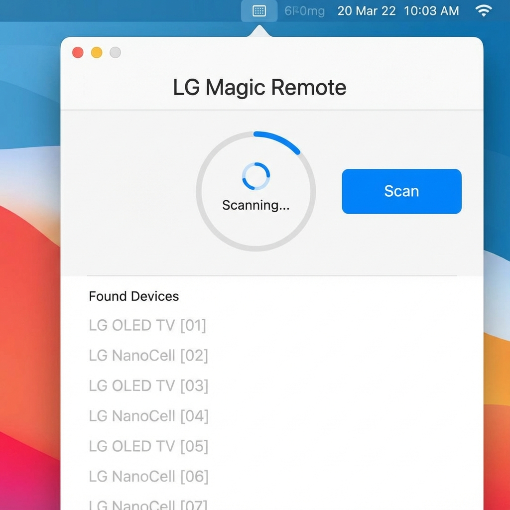
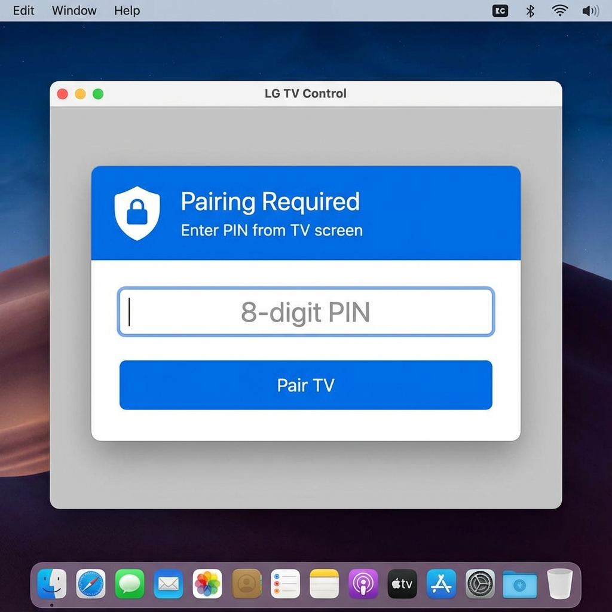
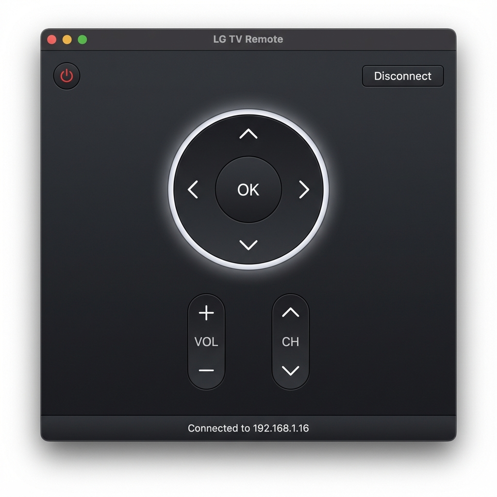

# LG WebOS TV Remote Control

A native macOS/iOS app for controlling LG WebOS Smart TVs using the WebSocket protocol. Features automatic TV discovery, seamless pairing, and a beautiful interface inspired by the LG Magic Remote MR24GA.


## ✨ Features

- 🔍 **Auto-Discovery** - Automatically finds LG WebOS TVs on your network in 3-5 seconds
- 🔐 **Seamless Pairing** - One-time PIN pairing with persistent connection
- 🎮 **Magic Remote Design** - Beautiful UI inspired by LG Magic Remote MR24GA
- ⚡ **Fast & Responsive** - Optimized network scanning and instant command execution
- 🔌 **Easy Switching** - Disconnect and connect to different TVs with one tap
- 📱 **Cross-Platform** - Works on macOS 13.0+ and iOS 16.0+

## 📸 Screenshots

### TV Discovery


Automatically scans your network and finds all LG WebOS TVs in seconds.

### Pairing


Simple PIN-based pairing - enter the code shown on your TV screen.

### Remote Control


Full-featured remote control with navigation, volume, channels, and quick access buttons.

## 🚀 Quick Start

### Prerequisites

- macOS 13.0+ or iOS 16.0+
- Xcode 15.0+
- LG WebOS TV (2014 or newer)
- TV and device on the same Wi-Fi network

### Installation

1. Clone the repository:
```bash
git clone https://github.com/aessam270/TVRemoteApp.git
cd TVRemoteApp
```

2. Open in Xcode:
```bash
open Package.swift
```

### Running on iPhone (iOS)

1. **Connect your iPhone** to your Mac with a cable.
2. In Xcode, select **TVRemoteApp** scheme and choose your **iPhone** from the device list (top bar).
3. Press `Cmd + R` to build and run.
4. **Trust Developer**: On your iPhone, go to **Settings > General > VPN & Device Management**, tap your Apple ID, and tap **Trust**.
5. **Permissions**: When the app launches, tap **Allow** for "Local Network" access to find your TV.

> **Note**: If Xcode doesn't automatically pick up the `Info.plist`, you may need to:
> 1. Click on the `TVRemoteApp` project icon in the left sidebar.
> 2. Select the `TVRemoteApp` target.
> 3. Go to **Build Settings**.
> 4. Search for "Info.plist File".
> 5. Set it to `Info.plist`.

### Running on Mac

1. Select **My Mac** from the device list.
2. Press `Cmd + R`.

### First Time Setup

1. **Launch the app** - It will automatically scan for TVs
2. **Tap your TV** from the discovered list
3. **Enter PIN** - A PIN will appear on your TV screen
4. **Start controlling** - You're all set!

## 🎮 Supported Commands

| Feature | Description |
|---------|-------------|
| **Power** | Turn TV on/off |
| **Navigation** | Up, Down, Left, Right, OK |
| **Volume** | Volume up/down, Mute |
| **Channels** | Channel up/down |
| **Quick Access** | Home, Back, Menu, Info |

## 🏗️ Architecture

### Tech Stack

- **Swift** - Native app development
- **SwiftUI** - Modern declarative UI
- **WebOSClient** - WebSocket communication library
- **Combine** - Reactive programming

### Project Structure

```
TVRemoteApp/
├── TVRemoteApp.swift      # App entry point
├── TVRemoteView.swift     # Main UI (Magic Remote design)
├── WebOSManager.swift     # TV communication & discovery
├── Package.swift          # Dependencies
└── README.md             # This file
```

### Key Components

**WebOSManager**
- Handles WebSocket connection to TV
- Manages network scanning and TV discovery
- Implements pairing flow
- Sends remote control commands

**TVRemoteView**
- SwiftUI interface with Magic Remote design
- Auto-discovery UI
- Pairing PIN entry
- Remote control buttons

## 🔧 Configuration

### Scanning Optimization

The app scans IPs 1-20 by default for fast discovery. To scan more IPs, edit `WebOSManager.swift`:

```swift
// Change this line in scanNetworkForTVs()
let quickScanRange = Array(1...20)  // Increase range if needed
```

### Connection Timeout

Default timeout is 200ms. Adjust in `testWebOSPort()`:

```swift
var timeout = timeval(tv_sec: 0, tv_usec: 200000)  // Microseconds
```

## 🐛 Troubleshooting

### TV Not Found

- ✅ Ensure TV is powered on (not in standby)
- ✅ Check both devices are on the same Wi-Fi network
- ✅ Try clicking "Scan" again
- ✅ Verify TV's WebOS version (2014+)

### Pairing Failed

- ✅ Enter the PIN within 30 seconds
- ✅ Make sure PIN is exactly 8 digits
- ✅ Try disconnecting and reconnecting

### Connection Lost

- ✅ Check Wi-Fi connection
- ✅ Restart the TV
- ✅ Click "Disconnect" and reconnect

## 📝 License

MIT License - see [LICENSE](LICENSE) file for details

## 🙏 Acknowledgments

- [WebOSClient](https://github.com/jareksedy/WebOSClient) - Swift library for WebOS TV communication
- LG Electronics - For the WebOS TV platform
- Community contributors

## 🤝 Contributing

Contributions are welcome! Please feel free to submit a Pull Request.

1. Fork the repository
2. Create your feature branch (`git checkout -b feature/AmazingFeature`)
3. Commit your changes (`git commit -m 'Add some AmazingFeature'`)
4. Push to the branch (`git push origin feature/AmazingFeature`)
5. Open a Pull Request

## 📧 Contact

For questions or support, please open an issue on GitHub.

---

**Made with ❤️ for LG WebOS TV users**
